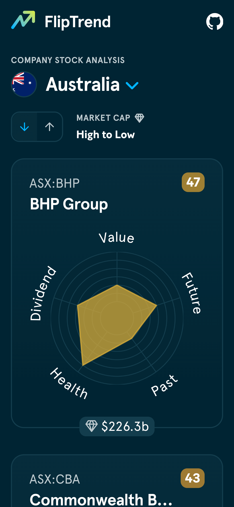
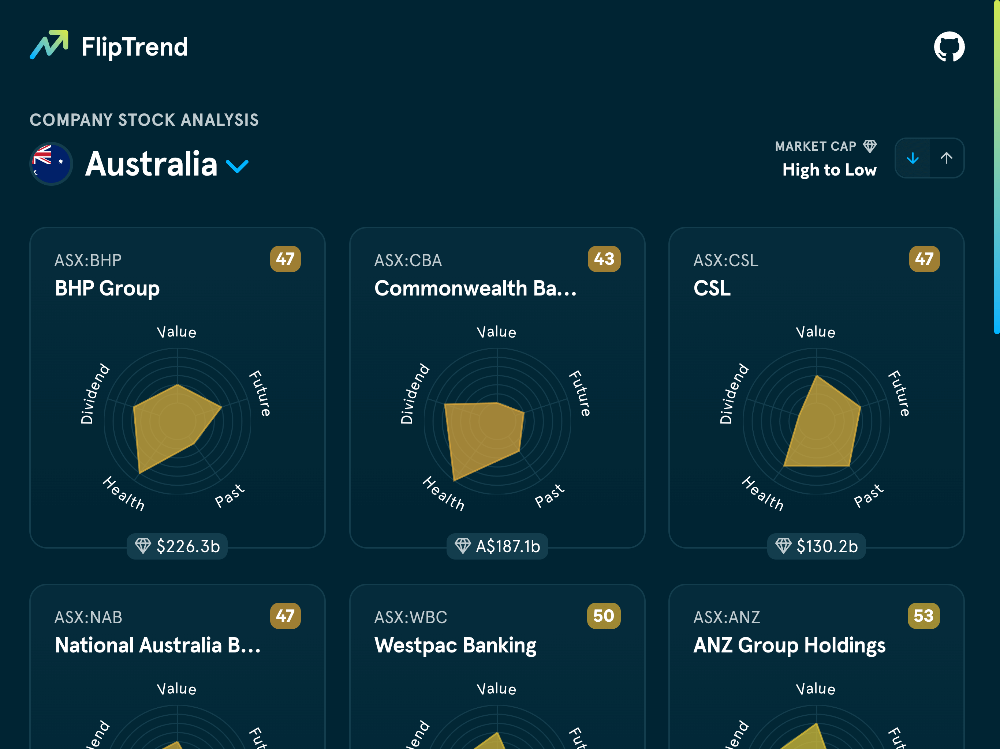

# FlipTrend

<p><a href="https://fliptrend.benrogerson.dev/" target="_blank"></a></p>

A web app to display company stock scores by country and sort by market cap.

<p>
    <a href="https://fliptrend.benrogerson.dev/" target="_blank"></a>
    <span></span>
    <a href="https://fliptrend.benrogerson.dev/" target="_blank"></a>
</p>

Check out the app at: 💹 [fliptrend.benrogerson.dev](https://fliptrend.benrogerson.dev/)

## Why I chose&hellip;

Here’s a breakdown of why I chose some of the tools and libraries I used:

- Why use client rendering (non-ssr)
  - This app aims to be as simple as possible and improve performance (no over engineering) - Server-Side Rendering adds a server and more complexity.
  - SEO is not a priority - this is a private app for a small group of users.
  - The app is small and doesn’t require the performance benefits of SSR (like improving [TTFB](https://web.dev/articles/ttfb)/[FCP](https://web.dev/articles/fcp)).
  - The page content is highly dynamic and interactive, so client rendering is a better fit.
- Why [Vite](https://vitejs.dev/)
  - Vite is a modern build tool that is fast and simple to use.
  - It’s light and doesn’t require a complex setup.
  - It has a great developer experience with features like hot module replacement.
  - It’s not like Webpack - configuration is simple and easy to understand.
  - It’s well suited for small Client-side rendered (CSR) apps like this one. If SSR is required then [Remix.js](https://remix.run/) would be a better choice (it uses Vite under-the-hood).
- Why [TailwindCSS](https://tailwindcss.com/)
  - It only creates css from the classes you use, so the css output is very light.
  - It’s easy to use and has a great developer experience.
  - It’s great for prototyping and iterating quickly.
  - It’s easy to customise and extend.
  - It’s quick to add styles for responsive design and animation.
  - Tradeoffs:
    - It can be hard to read the JSX and maintain in large projects.
    - It forces you to use components to avoid duplicate class sets (good thing though).
    - You need to use a helper like [`clsx`](https://www.npmjs.com/package/clsx) or [`classnames`](https://www.npmjs.com/package/classnames) to work with conditional classes and large class sets.
- Why [Tanstack Query](https://tanstack.com/query/latest)
  - It’s a great data fetching library that’s easy to use and has a great developer experience.
  - It’s simple and light and doesn’t require a complex setup.
  - It’s great for caching and refetching data and handles a bunch of common use cases.
- Why [Million.js](https://million.dev/)
  - It’s a faster React compiler that removes the diffing algorithm.
  - It’s great for large lists, like this app has after you scroll a few times.
  - Tradeoffs:
    - Elements in the dev tools are nested in `<slot>`.
    - Sometimes React errors/warnings are covered up.
    - SVG display is sometimes a little buggy and requires some "opt out" code.
    - It’s newer tech so there’s probably some more bugs to be found.
- Why [Wouter](https://www.npmjs.com/package/wouter)
  - It’s a tiny router for React that’s easy to use and has a great developer experience.
  - It’s simple and light and doesn’t require a complex setup.
  - It offers hooks for easy navigation and URL params.
  - It a similar api to React Router, so it’s familiar and easy to switch to if needed.
  - It has a great name 😄
- Why [Vitest](https://vitest.dev/)
  - It couples well with Vite, is easy to set up and natively supports ESM (unlike Jest).
  - It shares the same config as Vite, so it’s easy to use and understand.
  - It’s fast and has a great developer experience.

## Accessibility

I took some time to ensure the app is accessible to all users. Here’s a breakdown of the accessibility features I added:

- [x] Used the chrome dev tools DOM Tree view to assess the accessibility tree.
- [x] Made app accessible by keyboard navigation.
- [x] Github icons: Ensured icons have `aria-label` for screen readers.
- [x] Company search: Used [Radix accessible components](https://www.radix-ui.com/primitives/docs/overview/accessibility) to ensure a wide range of A11y and UX features are available (Eg: `aria` and `role` attributes, focus management, and keyboard navigation).
- [x] Company results list: Added [`role="feed"`](https://developer.mozilla.org/en-US/docs/Web/Accessibility/ARIA/Roles/feed_role) and an accompanying dynamic `aria-busy` to announce changes to screen readers.
- [x] Snowflake graph: Added custom screen-reader text to announce the total company scores and individual scores.
- [x] Company market cap: Added an `aria-label` to pronounce the value in a better way for screen readers.
- [x] Company score: Added a custom `aria-label` to pronounce the value in a better way for screen readers.
- [x] Sort by market cap
  - Used `:has(:focus-within)` to highlight to the sorting arrow container when focussed for keyboard users (but not for pointer users).
  - Added a custom `aria-label` to the sorting arrow to announce the sort order to screen readers.
  - Hid the visual text to screen readers using `aria-hidden` to avoid duplicate announcements.
  - [x] Ensured elements have sufficient foreground/background contrast ratios.
  - [x] Form elements have associated labels.

## Tests

I added some basic tests to ensure some of the app works as expected. I would add more in a production-grade app but I wanted to keep this project simple and was balancing time constraints. Here are the tests I added:

- [x] Added a test to ensure the app renders without crashing.
- [x] Added component tests to ensure the sort function works (using `@testing-library/react`).
- [x] Added tests to ensure api data is fetched and displayed correctly.
- [x] Added tests to ensure the generated graph colors work.
- [x] Added tests to ensure the large market cap abbreviations work.

TODO

- [ ] Add more tests.
- [ ] Setup `Cypress`/`Playwright` (with `@testing-library/react`) for E2E testing.

## Internationalization (i18n)

I chose not to add internationalization to this project to focus more on performance / UX / A11y. If I were to add internationalization, I would look at libraries like [`FormatJS Intl`](https://formatjs.io/docs/intl/) or [`i18next`](https://www.npmjs.com/package/i18next) to handle translations and locale switching.

## Performance improvements

I spent some time improving the performance of the app. Here’s a breakdown of the performance improvements I made (larger benefits starred):

- [x] ⭐ Company list: Added custom virtualization using intersection observer.
  - Tradeoffs:
    - Say goodbye to browser based "Find" (⌘F).
    - Scrolling fast can sometimes cause the list to jump around.
    - Scrolling fast can show empty company cards for a split second while the observer "catches up".
- [x] ⭐ Country picker:
  - Added virtualization using [TanStack Virtual](https://tanstack.com/virtual/latest) to improve performance when scrolling through list.
    - Tradeoff: Had to abandon the built in filtering support from the [cmdk](https://cmdk.paco.me/) package and add my own.
  - Used `React.lazy` to lazy load the CountryList component as it’s not visible by default - it will only load once the select is triggered.
- [x] ⭐ Used [Lighthouse](https://chromewebstore.google.com/detail/lighthouse/blipmdconlkpinefehnmjammfjpmpbjk) in the Chrome developer tools and [Google PageSpeed Insights](https://pagespeed.web.dev/) to improve desktop and mobile performance scores.
- [x] Added [Million.js](https://million.dev/docs/introduction#why-millionjs) to speed up React reconciliation
  - It benefits the large company list which contains many elements including svg's and charts.
  - It removes the React diffing algorithm and directly updates the DOM nodes instead which is faster.
    - Here are the figures it's claiming:
      - `<MainContent>` renders ~13% faster
      - `<Footer>` renders ~57% faster
      - `<LoaderFetch>` renders ~67% faster
      - `<LoaderCard>` renders ~43% faster
      - `<SortMarketCap>` renders ~82% faster
      - `<CountryDropdownTrigger>` renders ~33% faster
- [x] Used [Tailwind CSS](https://tailwindcss.com/) for styling to ensure minimal css generation from only the used classes.
- [x] Used the [Web Vitals Extension](https://github.com/GoogleChrome/web-vitals-extension) to assess page load performance and improve metrics throughout development.
- [x] Added `<link rel="preconnect" href="https://simplywall.st" crossorigin />` to the head of the document to reduce the time taken to connect to the API.
- [x] Added `<link rel="preconnect" href="https://upload.wikimedia.org" crossorigin />` to the head of the document to reduce the time taken to connect to wikipedia to grab the company flag svgs.
- [x] Minified all SVG's using [Iconish](https://iconish.benrogerson.dev/) (my own svg minifier) to reduce files sizes and align strokes.
- [x] Code splitting:
  - Configured Rollup to output separate .js bundles to potentially take advantage of parallel loading and to keep bundle size underneath `500kb`.

## SEO

This app isn’t designed with SEO in mind. If I were to improve SEO, I would switch to a server-rendered implementation with Next.js or Remix.

To avoid search engine indexing, I added a `robots.txt` file containing code to disallow all search engine bots from indexing the site. I also added a meta tag to the head of the document to prevent indexing.

Here’s some items I did add, which would be beneficial for SEO:

- [x] Added a custom `useTitle` hook to add meta tags to the head of the document.
- [x] Route to the country name when a specific country is chosen, eg: `/au`
- [x] Avoided using `div` for semantic elements like buttons and links.
- [x] Used semantic elements like `section`, `article`, `header`, `footer`, and `main` where appropriate.

I also followed SEO best practices as directed using PageSpeed Insights and Lighthouse.

## Responsive design

The app is fully responsive and displays well on all screen sizes.

I used CSS container queries to ensure the app adapts to different screen sizes and orientations.
In particular, these were handy for the company cards, as the layout changes depending on the screen size, and the company cards themselves change their layout based on their container size. This ensures the cards always look good and display their best layout for the space they each have available.

I also made the company search box adapt for smaller devices by switching it to a swipeable bottom modal. This ensures the user can easily see and interact with the list of countries because interacting with a traditional select-style dropdown kinda sucks on mobile.

I also ensured that interactive elements are large enough to be easily tapped on mobile devices. For example, the market cap sort buttons are intentionally large for this reason - it also benefits pointer interactions too as they’re larger hit areas.

## Fonts

- [x] ⭐ Removed unused characters from custom fonts using [FontForge](https://fontforge.org/en-US/) to reduce the total custom font file size by 238%.
- [x] ⭐ Compressed fonts to WOFF2 format with [cloudconvert](https://cloudconvert.com) to reduce the file size.
- [x] Added `font-display: swap;` to the custom `@font-face` declarations to show a fallback font if the specified font is still loading.

## File/folder structure

As this is a small project while still requiring component organisation, I chose a component-based structure where files are primarily organised around the reusable UI components:

```shell
# Component-based project structure (current)
└── src
    ├── components
    │   ├── CompanyCard
    │   ├── CompanyPicker
    │   │   ├── CompanyPicker.tsx
    │   │   └── CountryList.tsx
    ├── data
    ├── hooks
    ├── layouts
    ├── schemas
    ├── utils
    ├── App.tsx
    └── main.tsx
```

The rest of the folders are kept flat to reduce complexity. This structure was chosen as it’s most suitable for smaller projects when there are not too many features and where components are the primary building blocks.
This structure also makes it easier to locate and maintain code related to specific UI elements.

<details>
  <summary>But what if the project grows?... 🤔</summary>
<br/>
Should this project grow, I would consider upgrading to a feature-based structure where files are better organised in the components folder around the features of the app. A services folder could be added to better group the non-component features and a pages folder for the main app pages:

```shell
# Feature-based project structure
└── src
    ├── components
    │   ├── FeatureA
    │   │   ├── ...
    │   └── FeatureB
    │       ├── ...
    ├── hooks
    ├── pages
    │   ├── Home.tsx
    │   ├── ...
    ├── services
    │   ├── api
    │   ├── ...
    ├── utils
    └── index.tsx
```

If the project were to grow past that, I would consider a domain-based structure where files are organised by the domains of the app at top level. This would be suitable for complex functionality as it provides a better design for scalability and maintainability. Note the `common` folder for shared components, hooks, services, and utils:

```shell
# Domain-based project structure
└── src
    ├── common
    │   ├── components
    │   ├── hooks
    │   ├── services
    │   └── utils
    ├── auth
    │   ├── components
    │   ├── hooks
    │   ├── pages
    │   └── ...
    └── index.tsx
```

Anything beyond this would require a more complex structure with a monorepo setup, microservices, or a more complex architecture.

</details>

## Run this project locally

1. Clone the project:

```shell
npx degit https://github.com/ben-rogerson/FlipTrend FlipTrend
```

2. cd into the project and install the dependencies:

```shell
cd $_ && pnpm install
```

3. Then choose one of these tasks:

Start the development server:

```shell
pnpm run dev
```

Or build and preview the project:

```shell
pnpm run build
pnpm run preview
```

## Supported browsers

Tested in:

- Chrome (123)
- Firefox (123.0.1)
- Safari (17.4)
- Edge (124)

Also tested on mobile Chrome and Safari.

## TODO

If I had spent more time on this project, I'd consider working on:

- [ ] Mobile: Fix occasional card display issues when scrolling
- [ ] Add support for card height re-calculation on window resize
- [ ] Tests: Add more of them (+ Adding E2E tests would be good)
- [ ] Further accessibility testing
- [ ] Add internationalization support
- [ ] Fix location button hover/trigger width
- [ ] Mobile: Improve page speed scores
- [ ] Look at reducing chart.js file size
